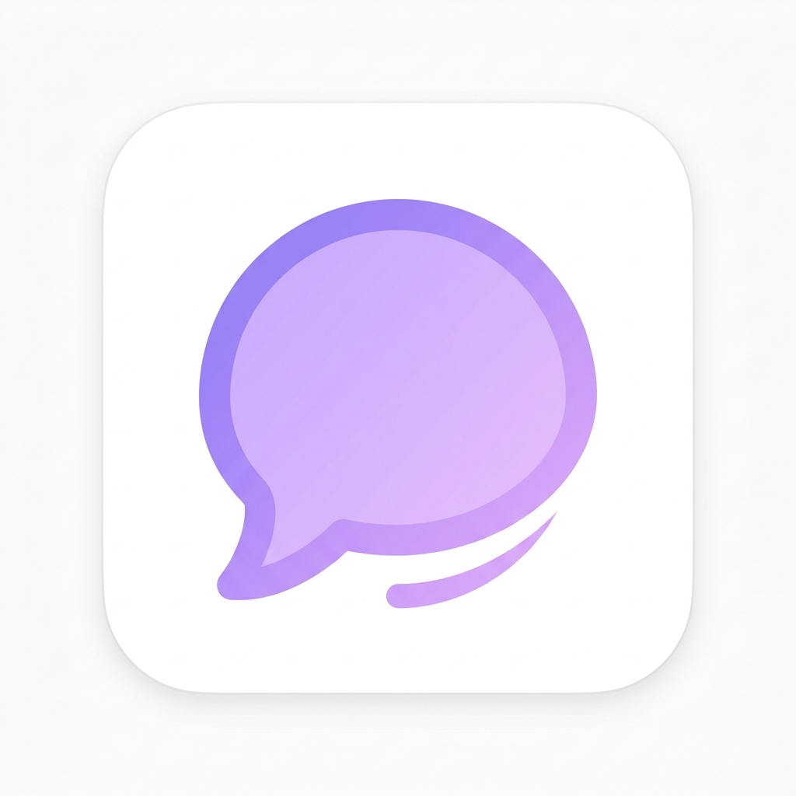
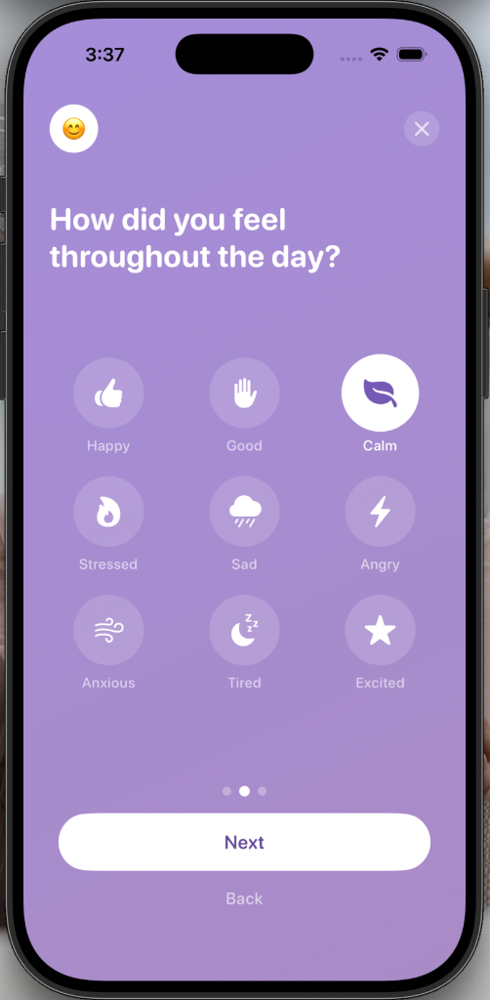
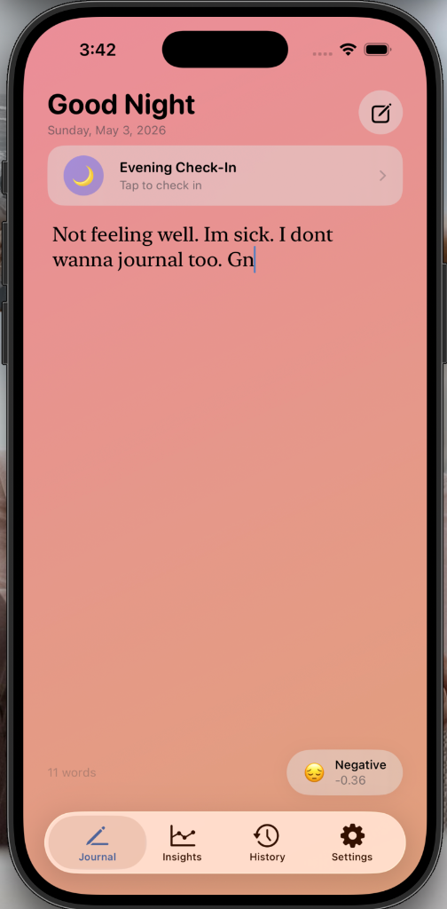
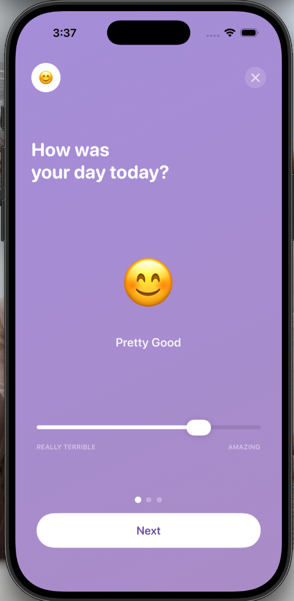
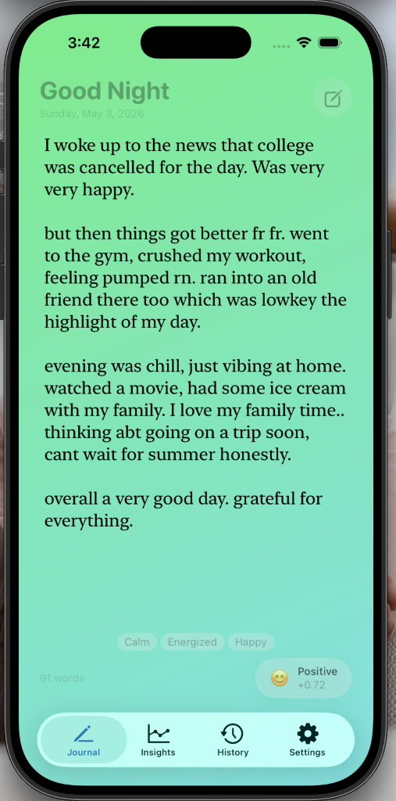
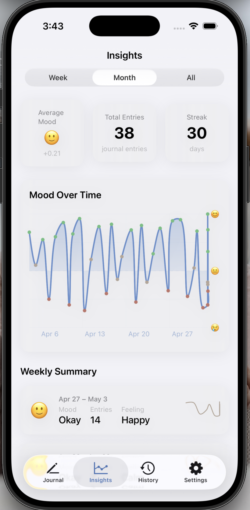
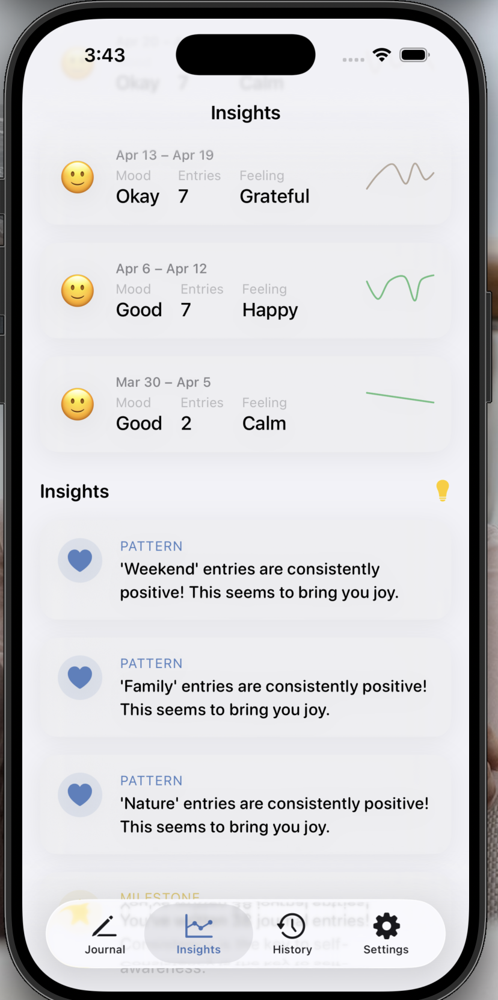

<p align="center">
  
</p>

<h1 align="center">Vent</h1>

<p align="center">
  <em>Your unfiltered journal. Write like you're texting a friend.</em>
</p>

<p align="center">
  
  
  
  
  
</p>

---

## ✨ What is Vent?

**Vent** is a privacy-first iOS journaling app that understands how you *actually* talk. No formal writing needed — use slang, abbreviations, modern lingo — Vent gets it.

It uses **on-device AI** to analyze your emotions in real-time as you type, changes the background color to match your mood, and tracks your emotional patterns over time with beautiful charts and insights.

**Zero data leaves your device. Ever.**

---

## 📱 Screenshots

<p align="center">
  
  &nbsp;
  
  &nbsp;
  
  &nbsp;
  
</p>

<p align="center">
  
  &nbsp;
  
</p>

---

## 🔥 Top Features

### 🎨 Dynamic Mood Background
The entire screen changes color based on what you write — **in real-time**.
- **Positive** vibes → Green/Teal gradient
- **Neutral** vibes → Warm Beige
- **Negative** vibes → Coral/Orange gradient

The transition is smooth and animated, giving you instant visual feedback on your emotional state.

### 🧠 AI That Gets You
Unlike generic sentiment tools, Vent's engine understands **real language**:
- **100+ slang/abbreviations** expanded automatically: `rn`, `ngl`, `tbh`, `fr fr`, `bussin`, `goated`, `lowkey`, etc.
- **Context-aware scoring**: "bored... wanna watch a movie rn" = **neutral** (not negative). It understands you're just idle, not sad.
- **16 emotional tones** detected: Happy, Calm, Excited, Playful, Grateful, Proud, Nostalgic, Romantic, Hopeful, Bored, Anxious, Stressed, Sad, Angry, Tired, Confused
- Powered by Apple's **Natural Language framework** — all processing happens on your iPhone

### 💜 Interactive Mood Check-In
Beautiful full-screen check-in flow (morning, afternoon, and evening):
1. **Rate your day** with a slider — the emoji face changes as you slide
2. **Pick your emotion** from 9 interactive icons
3. **Add a note** (optional)

Inspired by premium wellness apps — smooth animations, lavender gradient, buttery transitions.

### 📊 Mood Insights Dashboard
- **Swift Charts** line graph showing mood trends over weeks/months
- **Weekly summaries** with mini sparkline charts
- **AI-generated insights**: "Your weekends are 23% happier than weekdays"
- **Streak tracking**: see how many days in a row you've journaled

### 📝 Distraction-Free Writing
- Full-screen minimal editor — no clutter
- **No autocorrect** — write naturally, like texting
- Auto-save after 2 seconds of inactivity
- Real-time word count and emotional tone pills
- Time-based greeting (Good Morning / Afternoon / Evening / Night)

### 🔒 100% Private
- All data stored **locally** using SwiftData
- All ML runs **on-device** — no API calls, no servers, no cloud
- No third-party dependencies — pure Apple frameworks
- No tracking, no analytics, no accounts

---

## 🛠 Tech Stack

| Layer | Technology |
|-------|-----------|
| **UI** | SwiftUI |
| **Storage** | SwiftData |
| **ML/NLP** | Apple Natural Language Framework |
| **Charts** | Swift Charts |
| **Architecture** | MVVM with `@Observable` |
| **Concurrency** | Swift Actors + async/await |
| **Target** | iOS 17+ |

---

## 📁 Project Structure

```
SentimentJournal/
├── Models/
│   ├── JournalEntry.swift       # Core journal entry model
│   ├── MoodRecord.swift         # Aggregated daily mood data
│   └── MoodCheckIn.swift        # Check-in responses
├── Services/
│   ├── SentimentService.swift   # NLP engine + slang expansion
│   ├── PersistenceService.swift # SwiftData CRUD
│   └── InsightsService.swift    # Pattern detection & insights
├── ViewModels/
│   ├── JournalViewModel.swift   # Debounced analysis + auto-save
│   ├── InsightsViewModel.swift  # Chart data + summaries
│   └── HistoryViewModel.swift   # Search + filter
├── Views/
│   ├── Journal/                 # Editor, mood background, indicators
│   ├── CheckIn/                 # Interactive mood check-in flow
│   ├── Insights/                # Charts, summaries, insight cards
│   ├── History/                 # Entry list, detail view
│   ├── Settings/                # Preferences, data management
│   └── Navigation/              # Tab bar
├── Utilities/
│   ├── DesignSystem.swift       # Colors, typography, animations
│   ├── HapticManager.swift      # Haptic feedback
│   ├── DateFormatters.swift     # Shared formatters
│   ├── Extensions.swift         # Helpers & modifiers
│   └── SampleData.swift         # 30-day test dataset
└── SentimentJournalApp.swift    # App entry point
```

---

## 🚀 Getting Started

### Prerequisites
- **Xcode 15+**
- **iOS 17+ Simulator** (download in Xcode → Settings → Platforms)
- macOS Sonoma or later

### Run the App
1. Clone this repo
2. Open `Vent.xcodeproj` in Xcode
3. Select an iPhone simulator (e.g., iPhone 15 Pro)
4. Press `Cmd + R` to build and run
5. Go to **Settings → Load Sample Data** to populate test entries

---

## 👨‍💻 Designed & Created by Omar

---

<p align="center">
  <sub>Built with SwiftUI · No data leaves your device · Ever.</sub>
</p>
